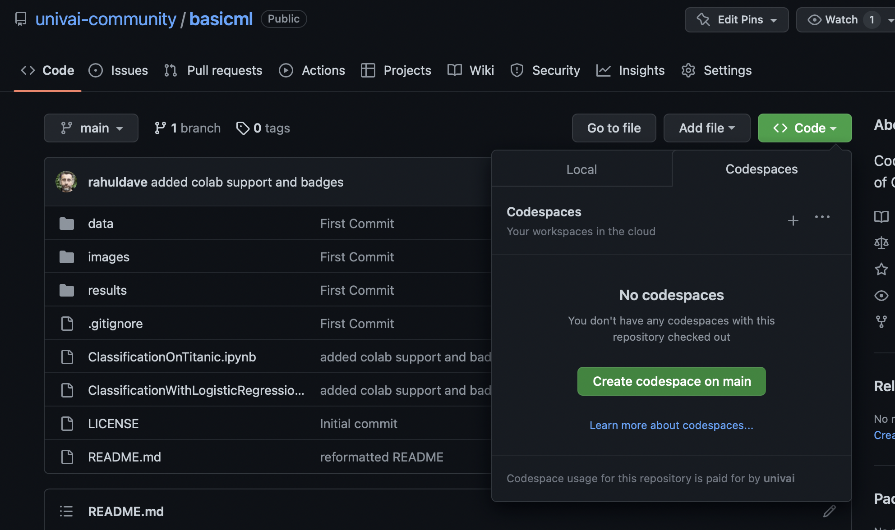

# basicml
Code-First Basic Machine Learning. Part of Code With Rahul.


## Contents

```
ClassificationOnTitanic.ipynb
ClassificationWithLogisticRegression.ipynb
data
images
LICENSE
README.md
results
```

## How to learn

Run the notebooks! You have 3 options:

1. Fork/Clone or Clone to your own machine and run the notebooks there (this assumes you have a working jupyterlab setup with sklearn installed)
2. You can open the notebooks in Colab with the links provided below
3. You can use Github Codespaces right here to run the code. You will need to be signed in to your github account. Then, click on the green "Code" button and navigate to the Codespaces tab. It looks like this:

.

Create the codespace by clicking on the "Create Codespace on main" green button. The repository will open up in Visual Studio Code (VSC). You can use the jupyter notebooks there since VSC supports Jupyter kernels. I recommend a light theme to go with the images I have used. If you forked this repo you can even add/commit/push your changes from VSC. 

If you add a "/?editor=jupyter" to the codespace link, you can even open the codespace in Jupyterlab (this can be set as default in your settings)

## The Notebooks

(1) Start with ClassificationWithLogisticRegression.ipynb . This notebook introduces the basic concepts of
Regression and Classification, in the context of a simple and simulated 1-feature classification problem. You
will learn about losses, probabilities, maximum likelihood, cross-entropy, the basic api of `sklearn`, and 
decision theory: the coversion of probabilities to classifications.

<a target="_blank" href="https://colab.research.google.com/github/univai-community/basicml/blob/main/ClassificationWithLogisticRegression.ipynb">
  
</a>


(2) In ClassificationOnTitanic.ipynb we'll take a real world dataset (with simulation to create more data) and
see what we must do to make it amenable to classification using two different models: Logistic Regression, and
k Nearest-Neighbors. We'll illustrate one methods of dealing with categorical data. We'll motivate the scaling of
numerical data and how you must take care not toleak data into your problem from the future. We'll also learn about training sets, validation sets and test sets. We'll see that validation sets can be used either to test perfomance on future data, or
to pick complexity "hyperparameter"s which prevent the model from overfitting. We also see how to use your model on future data: the process of inference

<a target="_blank" href="https://colab.research.google.com/github/univai-community/basicml/blob/main/ClassificationOnTitanic.ipynb">
  
</a>

## Exercise

As a post reading exercise, find out about regularization and the regularization hyperpaerameter C in Logistic regression. Use this knowledge to write code that produces a results table for logistic regression like the one in `results/results_lr.csv`
